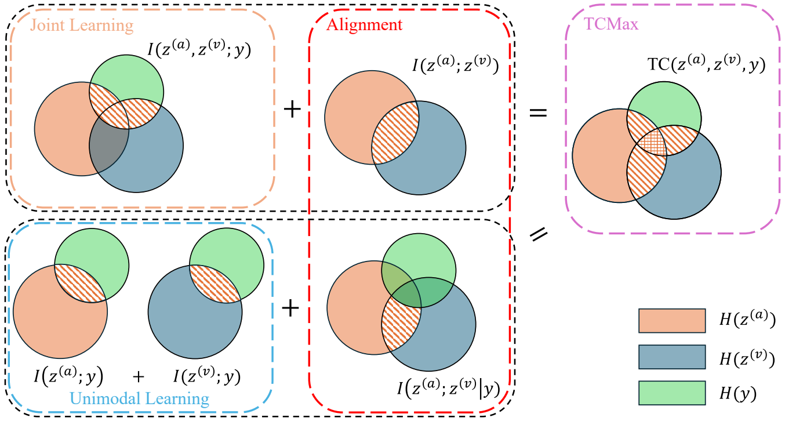

# Multimodal Classification via Total Correlation Maximization

[[Paper]](https://openreview.net/pdf?id=MbQhdzAhSl)

This repo is the official implementation of **Multimodal Classification via Total Correlation Maximization[ICLR 2026]**, and is built base on the code from [OGM-GE_CVPR2022](https://github.com/GeWu-Lab/OGM-GE_CVPR2022).

## Introduction
<center>

Figure 1: An illustration of the relationship between joint learning, unimodal learning, and learning through
maximizing the total correlation.
</center>

TCMax learns the model by maximizing the total correlation among all multimodal features and the labels. 
As can be seen from Figure 1, since both $I(z^{(a)};z^{(v)})$ and $I(z^{(a)};z^{(v)}|y)$ are non-negative, the training objective of maximizing total correlation also subsumes the objectives of joint learning and unimodal learning simultaneously. 
This endows TCMax with the strongest supervision, thereby helping prevent the model from overfitting to some extent while learning the interactions between modalities.

## Dataset Pre-processing
First download the original dataset:
[[CREMA-D](https://github.com/CheyneyComputerScience/CREMA-D)],
[[Kinetics-Sounds](https://github.com/cvdfoundation/kinetics-dataset)],
[[AVE](https://sites.google.com/view/audiovisualresearch)],
[[VGGSound](https://github.com/hubaak/Download_VGGSound)]
[[UCF101](https://www.crcv.ucf.edu/data/UCF101.php)]

**After downloading the datasets, edit src/configs/dataset_config.json to set the path of the datasets.**

#### CREMA-D
```bash
python -m src.data.CREMAD.video_preprocessing
python -m src.data.CREMAD.audio_preprocess
```

#### Kinetics-Sounds
```bash
python -m src.data.KineticsSound.video_preprocessing
python -m src.data.KineticsSound.kineticssound_audio_preprocess_fbank
```

#### AVE
```bash
python -m src.data.AVE.video_preprocessing
python -m src.data.AVE.mp4_to_wav
```

#### VGGSound
```bash
python -m src.data.VGGSound.mp4_to_wav
python -m src.data.VGGSound.VGGSound_audio_preprocess
python -m src.data.VGGSound.video_preprocessing
```

#### UCF101
```bash
python -m src.data.UCF101.video_2_images
python -m src.data.UCF101.video_2_OpticFlow
```

## Run the code
The demo scripts for each datasets are in `scripts`.
For example, to train with TCMax and Concat fusion on CREMA-D:
```bash
sh scripts/CREAMD.sh 
```

## TCMax Implementation
TCMax loss for two modalities $(a)$ and $(v)$ is denoted as:
$$
\begin{equation}
    \begin{split}
        \mathcal{L}_{\text{TCMax}} 
        &= -\frac{1}{\lvert \mathcal{B} \rvert} \sum_{i\in \mathcal{B}} \log{
            \frac{
                \exp{f_\theta\left(\psi^{(a)}_{\Theta_a}(x^{(a)}_i), \psi^{(v)}_{\Theta_v}(x^{(v)}_i)\right)}_{y_i}
            }
            {
                \sum_{(j,k,y^{'})\in \mathcal{B}\times\mathcal{B}\times \mathcal{Y}}  \exp{f_\theta\left(\psi^{(a)}_{\Theta_a}(x^{(a)}_j), \psi^{(v)}_{\Theta_v}(x^{(v)}_k)\right)}_{y^{'}}
            }
        }-\log{\lvert \mathcal{B} \rvert^2\lvert \mathcal{Y} \rvert}
    \end{split}.
\end{equation}
$$

With linear fusions (Concat, Share Head, Sum), there is a faster implementation of TCMax:
$$
\begin{equation}
    \begin{split}
        \mathcal{L}_{\text{TCMax}} 
        = -\frac{1}{\lvert \mathcal{B} \rvert} \sum_{i\in \mathcal{B}} \log{
            \frac{
                \exp{f_{\theta_a}^{(a)}(\psi^{(a)}_{\Theta_a}(x^{(a)}_i))}_{y_i} \exp{f_{\theta_v}^{(v)}(\psi^{(v)}_{\Theta_v}(x^{(v)}_i))}_{y_i}
            }
            {
                 \sum_{y^{'}\in \mathcal{Y}} 
                 \left( \sum_{j\in \mathcal{B}}\exp{f_{\theta_a}^{(a)}(\psi^{(a)}_{\Theta_a}(x^{(a)}_j))}_{y^{'}}\right)
                 \left( \sum_{k\in \mathcal{B}}\exp{f_{\theta_v}^{(v)}(\psi^{(v)}_{\Theta_v}(x^{(v)}_k))}_{y^{'}}\right)
            }
        }&
        \\
        -\log{\lvert \mathcal{B} \rvert^2\lvert \mathcal{Y} \rvert}.&
    \end{split}
\end{equation}
$$

The implementation of TCMax loss in our code:
```python
def TCMax_loss(args, model, a, v, label):
    B = a.shape[0]
    if args.fusion_method in ['sum', 'concat', 'share_head']: # Speed-up for linear fusions
        out_a = model.module.fusion_module.forward_a(a) # [B, C]
        out_v = model.module.fusion_module.forward_v(v) # [B, C]
        out_av_mat = out_a[:,None,:].repeat(1, B, 1) + out_v[None:,:].repeat(B, 1, 1) # [B, B, C]
    else:
        extend_a = a.view(B, 1, -1).repeat(1, B, 1) # [B, B, D]
        extend_v = v.view(1, B, -1).repeat(B, 1, 1) # [B, B, D]
        _, _, out_av_mat = model.module.fusion_module(extend_a.view(B*B, -1), extend_v.view(B*B, -1)) # [B*B, C]
        out_av_mat = out_av_mat.view(B, B, -1)
    
    prob_avl = torch.exp(out_av_mat-out_av_mat.mean())
    prob_avl = prob_avl / prob_avl.sum()
    idx = torch.arange(B, device=a.device)
    prob_avl_core = prob_avl[idx, idx, label]    
    prob_al_core = prob_avl.sum(dim=1)[idx, label]    
    prob_vl_core = prob_avl.sum(dim=0)[idx, label]   
    loss = - torch.log(prob_avl_core).mean() - math.log(B)
    loss_a = - torch.log(prob_al_core).mean() - math.log(B)
    loss_v = - torch.log(prob_vl_core).mean() - math.log(B)
    
    return loss, loss_a, loss_v
```


## Acknowledgement
This work is supported by the NSFC (62276131, 62506168), Natural Science Foundation of Jiangsu
Province of China under Grant (BK20240081, BK20251431).
And we gratefully acknowledge financial support from the China Scholarship Council (CSC)
(Grant No. 202506840036).

## License
This project is licensed under the *MIT License*.

## Contact us
If you have any questions or suggestions, please discuss them in `Issues` or email us at: `hubaak@njust.edu.cn`.